<div align="center">



<br /><br />

<a href="mailto:togiturker@gmail.com"></a>&nbsp;
&nbsp;


</div>

<br />

```bash
togi@buro ❯ cat hakkimda.md
```

> Hukuk bürosunun tekrar eden işlerini — UYAP işlemleri, masraf ödemeleri, mutabakat, banka portföy raporları — **çalışan masaüstü otomasyonlarına** çeviriyorum.
> Electron ve Node.js ile yazıyor; Excel, VBA ve PowerShell'i sonuna kadar kullanıyorum. Canlıya giden her şey önce doğrulanır.
> Bir de **Hungry Bugs Studio** var: 3D yazıcıda bastığım lambalar.

<br />

```bash
togi@buro ❯ buropilot hat --ciz
```



<br />

```bash
togi@buro ❯ ls ~/projeler --kart
```



<br />

```bash
togi@buro ❯ cat kurallar.yaml
```

```yaml
# Canlı sisteme dokunan her otomasyonda geçerli
kurallar:
  cift_kontrol:   "Bir partiyi yükleyen kişi onu onaylayamaz."
  yazma_kapali:   "Canlıya yazma bayrağı varsayılan olarak KAPALI."
  kisisel_veri:   "Gerçek TCKN, ad, adres, tutar ve dosya no; repoya, commit'e, rapora girmez."
  canli_para:     "Gerçek para harcayan komut yalnızca açık talimatla çalışır."
  yasam_dongusu:  "İşin sahibi backend: running → stopping → close → stopped."
  loglar:         "Append-only; geçmiş yeniden yazılmaz."
  eslestirme:     "Hibrit eşleştirmenin her katmanında tarih zorunlu."
  kimlik_bilgisi: "Kullanıcı girer; global .env dosyasına konmaz."
  teslim:         "Diff görülmeden hiçbir ajan raporu kabul edilmez."
dogrulama: [node --check, self-test, UAT, Excel readback, log marker, yasak kalıp taraması]
```

<br />



<div align="center">
<sub>© 2026 Tolgahan Türker · İstanbul · <i>İznik Gecesi</i> teması · görseller <code>tools/</code> içindeki üreticiyle çizildi</sub>
</div>
